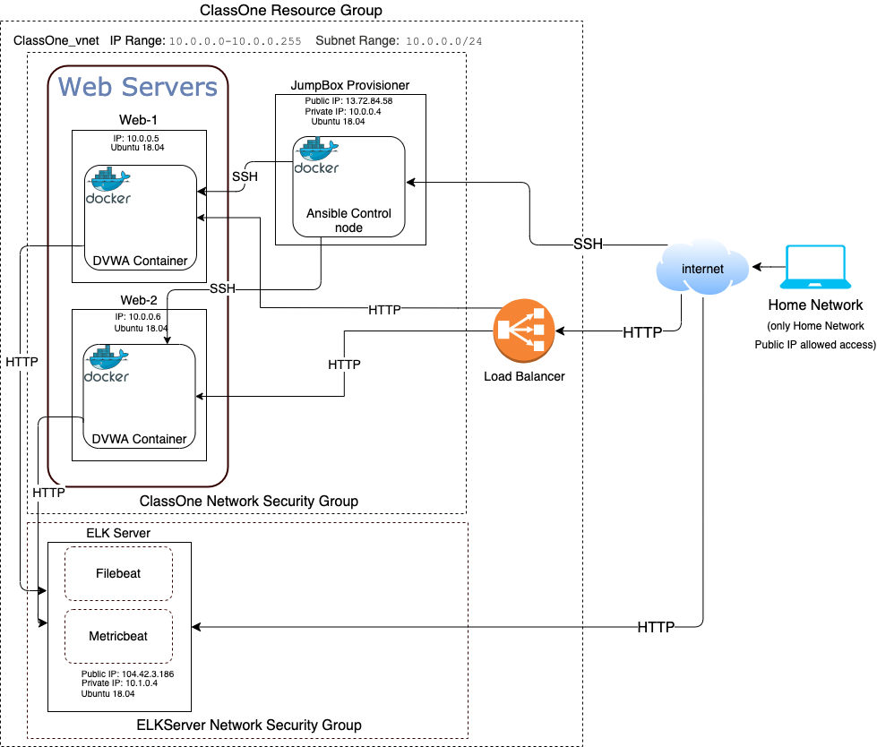

<!-- # AzureProject -->
<!-- Azure project with Docker and Ansible -->

## Automated ELK Stack Deployment

The files in this repository were used to configure the network depicted below:

These files have been tested and used to generate a live ELK deployment on Azure. They can be used to either recreate the entire deployment pictured above. Alternatively, select portions of the playbook file may be used to install only certain pieces of it, such as Filebeat.

  - [Playbook File 1: pentest.yml](playbooks/pentest.yml)
  - [Playbook File 2: install-elk.yml](playbooks/install-elk.yml)
  - [Playbook File 3: filebeat-playbook.yml](playbooks/filebeat-playbook.yml)
  - [Playbook File 4: metricbeat-playbook.yml](playbooks/metricbeat-playbook.yml)

This document contains the following details:
- Description of the Topology
- Access Policies
- ELK Configuration
  - Beats in Use
  - Machines Being Monitored
- How to Use the Ansible Build

### Description of the Topology

The main purpose of this network is to expose a load-balanced and monitored instance of DVWA, the D*mn Vulnerable Web Application.

Load balancing ensures that the application will be highly available, in addition to restricting access to the network.
- Load balancers increase reliability, uptime and access, while preventing DDOS attacks. They can manage health checks to report when a server is down and switch between redundant servers.
- A "Jump box" will allow an external connection through which an external device can connect to resources inside the network that do not allow external access. They can also run software (such as an Ansible Docker Container) to control/configure parts of the network.  

Integrating an ELK server allows users to easily monitor the vulnerable VMs for changes to the traffic and system logs.
- Filebeat monitors system logs and files
- Metricbeat will collet metrics from the server's operating system and services 

The configuration details of each machine may be found below.
_Note: Use the [Markdown Table Generator](http://www.tablesgenerator.com/markdown_tables) to add/remove values from the table_.

| Name      | Function | IP Address | Operating System |
|-----------|----------|------------|------------------|
| Jump Box  | Gateway  | 10.0.0.4   | Ubuntu 18.04     |
| WEB-1     | Webserver| 10.0.0.5   | Ubuntu 18.04     |
| WEB-2     | Webserver| 10.0.0.6   | Ubuntu 18.04     |
| ELK Server| Monitor  | 10.1.0.4   | Ubuntu 18.04     |

### Access Policies

The machines on the internal network are not exposed to the public Internet. 

Only the Jump Box and KIBANA (ELK SERVER) machines can accept connections from the Internet. Access to these machines is only allowed from the following IP address:
- 68.203.21.170

Machines within the network can only be accessed by SSH from the Jump Box, peering allows webservers to send data to ELK.
- Non-peering access is allowed from Jump Box, IP 10.0.0.4 via SSH (Port 22)

A summary of the access policies in place can be found in the table below.

| Name     | Publicly Accessible   | Allowed IP Addresses   |
|----------|-----------------------|------------------------|
| Jump Box | Yes                   | 68.203.21.170          |
| Web-1    | Yes via Load balancer | 68.203.21.170          |
| Web-2    | Yes via Load balancer | 68.203.21.170          |
| ELK      | Yes                   | 68.203.21.170          |

### Elk Configuration

Ansible was used to automate configuration of the ELK machine. No configuration was performed manually, which is advantageous because...
- The automation is faster than logging into the server then configuring manually and errors are easier to detect. Also, it can be replayed if server needs to be reinstalled.

The playbook implements the following tasks:
- Installs and configures docker
- Adjusts memory settings 
- Downloads/Installs/Launches ELK
- Configures Docker container to restart

The following screenshot displays the result of running `docker ps` after successfully configuring the ELK instance.

### Target Machines & Beats
This ELK server is configured to monitor the following machines:
- Web-1 (10.0.0.5) and Web-2 (10.0.0.6)

We have installed the following Beats on these machines:
- Filebeat and Metricbeat

These Beats allow us to collect the following information from each machine:
- Filebeat collect system logs which will allow us to see processes run by users. Metricbeat will allow us to collect metrics such as inbound and outbound traffic.

### Using the Playbook
In order to use the playbook, you will need to have an Ansible control node already configured. Assuming you have such a control node provisioned: 

SSH into the control node and follow the steps below:
- Copy the install-elk.yml file to /etc/ansible/roles/install-elk/tasks/install-elk.yml.
- Update the /etc/ansible/hosts file to include [elkserver] 104.210.46.134 ansible_python_interpreter=/usr/bin/python3
- Run the playbook, and navigate to http://104.210.46.134:5601/app/kibana to check that the installation worked as expected.
- **NOTE:** Please update 104.210.46.134 to your ELK server's Public IP address

_As a **Bonus**, provide the specific commands the user will need to run to download the playbook, update the files, etc._
